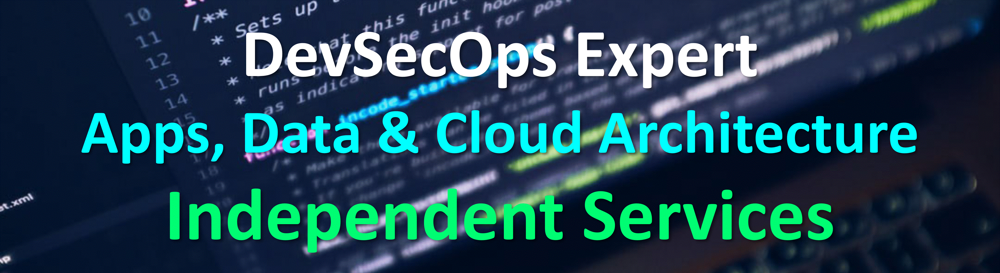

<!-- Title -->
<h1 align="center">Let's Hack! 
  
</h1>

<!-- Quote -->

Analyzing code to know what the input is..

  
  <!-- Social Network -->
<h1 align="center">

  <!--  -->

  

  
<!--  -->
</h1>

<!-- Background -->

<!-- I do add this "&nbsp;" because I can't center the GIFT, let me know if you know how do it -->
<!--&nbsp;&nbsp;&nbsp;&nbsp;&nbsp;&nbsp;&nbsp;&nbsp;&nbsp;&nbsp;&nbsp;&nbsp;&nbsp;&nbsp;&nbsp;&nbsp;&nbsp;&nbsp;&nbsp;&nbsp;&nbsp;&nbsp;&nbsp;&nbsp;&nbsp;&nbsp;&nbsp;&nbsp;&nbsp;&nbsp;-->
<!---->
<!--  -->
<!-- [GeorFolio](https://georgegxx.github.io) | [Att&ckFolio](https://georgegxx.gitlab.io) -->

&nbsp;

<!-- Technical Skills -->

<H3 align="center"><strong> Technical Skills: 💻 </strong>

  
  <code></code>
  <code></code>
  <code></code>
  <code></code> 
  <code></code>
  <code></code>
  <code></code>
  <code></code>
  <code></code>
  <code></code> 
  <code></code>
  <code></code>
  <code></code>
  <code></code>
  <code></code> 
  <code></code>
  <code></code>
  <code></code> 
  <code></code>
  

  <!-- <code></code> -->
  <!-- <code></code> -->
  <!-- <code></code> -->
  <!-- <code></code> -->
  <!-- <code></code> -->
  <!-- <code></code> -->
  <!-- <code></code> -->
  <!-- <code></code> -->
  <!-- <code></code>   -->  
  <!-- <code></code> -->
  <!-- <code></code> -->  
  <!-- <code></code> -->
  <!-- <code></code> -->
  <!-- <code></code> -->
  <!-- <code></code> -->
  <!-- <code></code> -->
  <!-- <code></code> -->
  <!-- <code></code> -->
  <!-- <code></code> -->
  <!-- <code></code> -->
  <!-- <code></code> -->
  </H3>

  
<!-- &nbsp;   -->

  <!-- Skills to learn -->
<!-- 
<H3 align="center"><strong>Skills to learn: 🌐</strong>

  

  <code></code>
  <code></code>
  <code></code>  
  <code></code>
  <!--<code></code>-->
  <!--<code></code>-->
  <!--<code></code>-->
  <!--<code></code>-->
  <!--<code></code>
  </H3>
 -->

&nbsp;

<h3 align="center">Status: .. </h3>

<h3 align="center">Working on random projects.</h3>

&nbsp;

<!-- GitHub Stats -->
<H2 align="center"><strong>GitHub Statistics: 📈
  </strong>
</H2>
    

      

    

    

  

